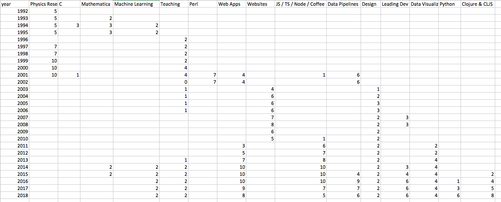

## Joyplots on a timeline (aka Ridgeline plot)

Most examples of joyplots online use kernel density estimates. This leads to curves for each row having the same or similar areas under the curve. There are multiple uses for joyplots and sometimes probability densities are correct. But other times one row may represent a lot of stuff (encoded in the y-axis) and another row represents a small amount of data.

So here is an Python example that uses a Seaborn facetgrid [like the Seaborn example](https://seaborn.pydata.org/examples/kde_ridgeplot.html) but with a matplotlib `plt.plot` instead of a Seaborn `kdeplot`.

This also includes transforms that allow a nice way to use a CSV format that's easy to fill out.

This does not include a y-axis titles. I titled it "How I spent my time, subjectively plotted". I made up the data based on memory. It's very subjective. Even with accurate data, joyplots have some problems, including occluding data behind it. As we all know, bar charts are best for accurately comparing data. But where's the joy in that?




Lastly, I know there is a small controversy over the name "joyplot" and the [renaming to Ridgeline plots](https://serialmentor.com/blog/2017/9/15/goodbye-joyplots). I'm not convinced this is the right move. From my understanding, Joy Division named themselves that as a critique, not a celebration. If someone has other information, let me know. In the meantime, we'll see what people settle on in the coming years.


## Running Notebook
If using `conda`, make sure to activate an environment(such as a clone from base)
```
conda env list
conda create --name base_dupe --clone base
conda activate base_dupe
conda info
```

Then install this (https://stackoverflow.com/a/42585283/1884101):
```
conda install nb_conda
```

Then start Jupyter notebook in that conda environment:
```
jupyter notebook
```
