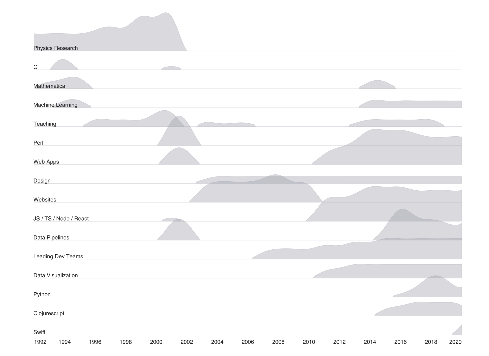

## Joyplots on a timeline (aka Ridgeline plot)

Most examples of joy plots online use kernel density estimates. This leads to curves for each row having the same or similar areas under the curve. There are multiple uses for joy plots and sometimes probability densities are correct. But other times one row may represent a lot of stuff (encoded in the y-axis) and another row represents a small amount of data.

So here is an Python example that uses a Seaborn facetgrid [like the Seaborn example](https://seaborn.pydata.org/examples/kde_ridgeplot.html) but with a matplotlib `plt.plot` instead of a Seaborn `kdeplot`.

This also includes transforms that allow a nice way to use a CSV format that's easy to fill out.

